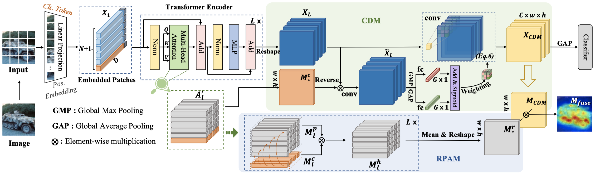

# LCTR: On Awakening the Local Continuity of Transformer for Weakly Supervised Object Localization (AAAI 2022)

PyTorch implementation of ''LCTR: On Awakening the Local Continuity of Transformer for Weakly Supervised Object Localization''. 

## 📋 Table of content
 1. [📎 Paper Link](#1)
 2. [💡 Abstract](#2)
 3. [📖 Method](#3)
 4. [📃 Requirements](#4)
 5. [✏️ Usage](#5)
    1. [Start](#51)
    2. [Prepare Datasets](#52)
    3. [Training](#53)
    4. [Inference](#54)
 6. [🔍 Citation](#6)
 7. [❤️ Acknowledgement](#7)

## 📎 Paper Link <a name="1"></a> 
> LCTR: On Awakening the Local Continuity of Transformer for Weakly Supervised Object Localization ([link](https://www.aaai.org/AAAI22Papers/AAAI-329.ChenZ.pdf))
* Authors: Zhiwei Chen, Changan Wang, Yabiao Wang, Guannan Jiang, Yunhang Shen, Ying Tai, Chengjie Wang, Wei Zhang, Liujuan Cao
* Institution: Xiamen University, Xiamen, China. Tencent Youtu Lab, Shanghai, China. CATL, China

## 💡 Abstract <a name="2"></a> 
Weakly supervised object localization (WSOL) aims to learn object localizer solely by using image-level labels. The convolution neural network (CNN) based techniques often result in highlighting the most discriminative part of objects while ignoring the entire object extent. Recently, the transformer architecture has been deployed to WSOL to capture the long-range feature dependencies with self-attention mechanism and multilayer perceptron structure. Nevertheless, transformers lack the locality inductive bias inherent to CNNs and therefore may deteriorate local feature details in WSOL. In this paper, we propose a novel framework built upon the transformer, termed LCTR (Local Continuity TRansformer), which targets at enhancing the local perception capability of global features among long-range feature dependencies. To this end, we propose a relational patch-attention module (RPAM), which considers cross-patch information on a global basis. We further design a cue digging module (CDM), which utilizes local features to guide the learning trend of the model for highlighting the weak local responses. Finally, comprehensive experiments are carried out on two widely used datasets, ie, CUB-200-2011 and ILSVRC, to verify the effectiveness of our method.

## 📖 Method <a name="3"></a> 

<p align="center">
     <br />
    <em> 
    </em>
</p>
Overview of the proposed LCTR, which consists of vision transformer backbone for feature extraction, relational patch-attention module (RPAM) and cue digging module (CDM).

## 📃 Requirements <a name="4"></a> 
  - PyTorch==1.7.0  
  - torchvision==0.8.1
  - timm==0.3.2

## ✏️ Usage <a name="5"></a> 

### Start <a name="51"></a> 

```bash  
git clone https://github.com/zhiweichen0012/LCTR.git
cd LCTR
```

### Prepare Datasets <a name="52"></a> 

* CUB ([http://www.vision.caltech.edu/visipedia/CUB-200-2011.html](http://www.vision.caltech.edu/visipedia/CUB-200-2011.html))
* ILSVRC ([https://www.image-net.org/challenges/LSVRC/](https://www.image-net.org/challenges/LSVRC/))

The directory structure is the standard layout for the torchvision [`datasets.ImageFolder`](https://pytorch.org/docs/stable/torchvision/datasets.html#imagefolder), and the training and validation data is expected to be in the `train/` folder and `val` folder respectively:

```
/path/to/imagenet/
  train/
    class1/
      img1.jpeg
    class2/
      img2.jpeg
  val/
    class1/
      img3.jpeg
    class/2
      img4.jpeg
```


### Training <a name="53"></a> 

To train LCTR on CUB with 4 GPUs run:

```bash
python3 -m torch.distributed.launch --nproc_per_node=4 --master_port=11240 --use_env main.py --model deit_small_lctr --batch-size 128 --data-path /path/to/CUB --output_dir /path/to/save --resume /path/to/weights/deit_small_patch16_224.pth --epochs 80 --data-set CUB --lr 5e-5
```

To train LCTR on ILSVRC with 4 GPUs run:

```bash
python3 -m torch.distributed.launch --nproc_per_node=4 --master_port=11240 --use_env main.py --model deit_small_lctr --batch-size 256 --data-path /path/to/IMNET --output_dir /path/to/save --resume /path/to/weights/deit_small_patch16_224.pth --epochs 14 --data-set IMNET --lr 5e-4
```

### Inference <a name="54"></a> 

To test the CUB models, you can run:

```bash  
python3 main.py --eval --model deit_small_lctr --data-set CUB --data-path /path/to/CUB --resume ./path/to/LCTR_CUB_model
```

To test the ILSVRC models, you can run:
```bash  
python3 main.py --eval --model deit_small_lctr --data-set IMNET --data-path /path/to/IMNET --resume ./path/to/LCTR_IMNET_model
```

## 🔍 Citation <a name="6"></a> 

```
@article{chen2021lctr,
  title={LCTR: On Awakening the Local Continuity of Transformer for Weakly Supervised Object Localization},
  author={Chen, Zhiwei and Wang, Changan and Wang, Yabiao and Jiang, Guannan and Shen, Yunhang and Tai, Ying and Wang, Chengjie and Zhang, Wei and Cao, Liujuan},
  booktitle={AAAI},
  year={2022}
}
```

## ❤️ Acknowledgement <a name="7"></a> 

We use [deit](https://github.com/facebookresearch/deit) and their [pre-trained weights](https://dl.fbaipublicfiles.com/deit/deit_small_patch16_224-cd65a155.pth) as the backbone. Many thanks to their brilliant works!